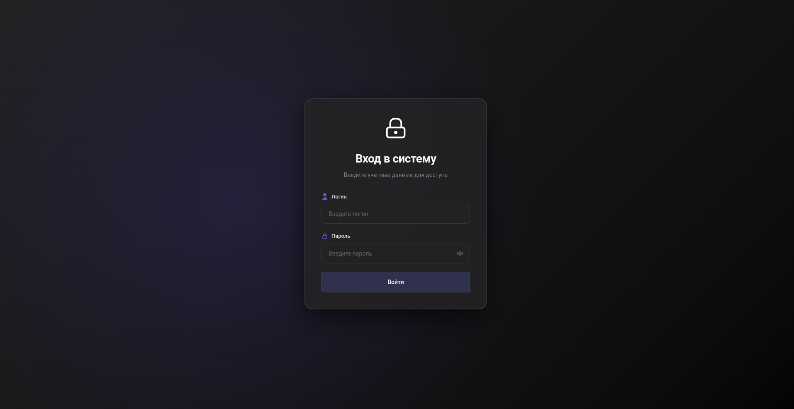
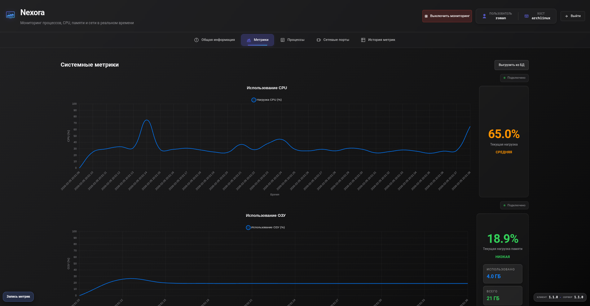
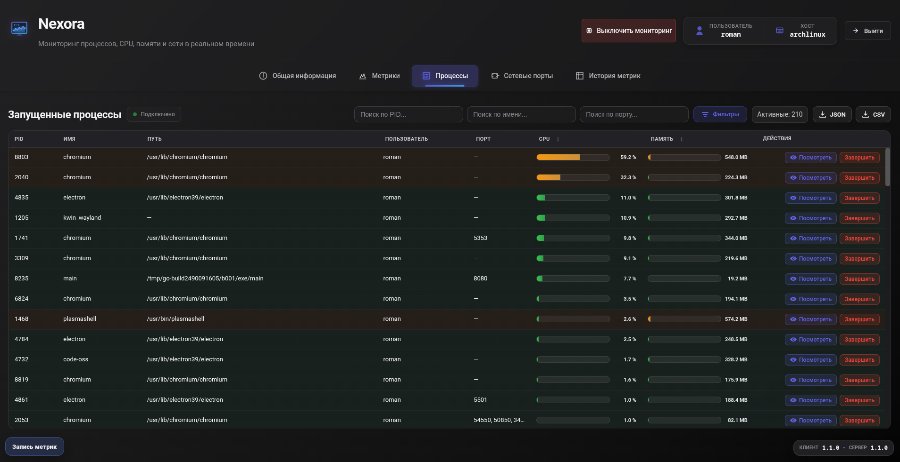
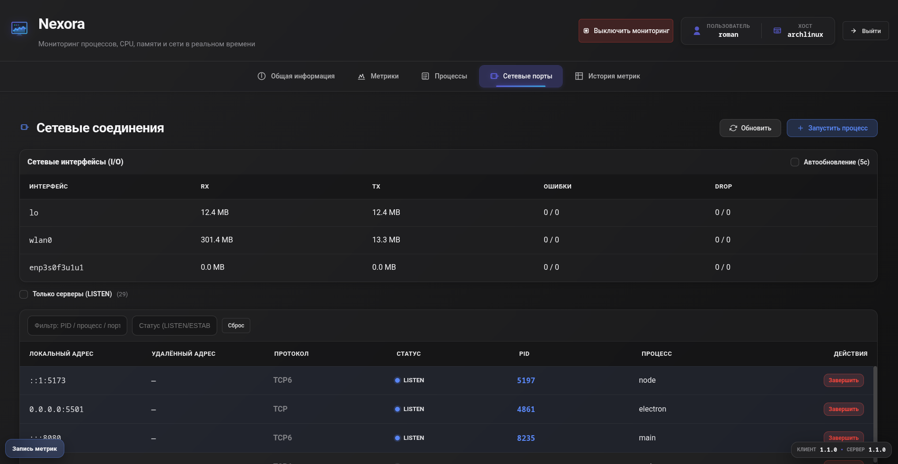
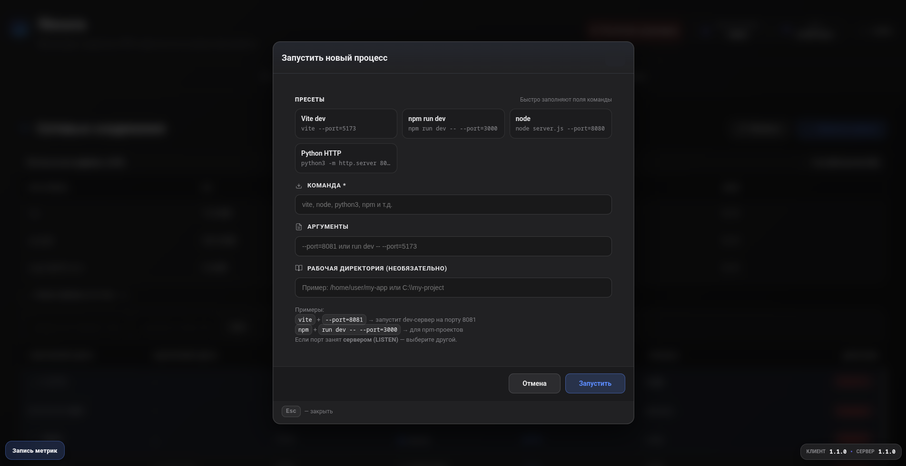

# Nexora (Vue 3 + Go Agent)

Nexora — приложение для мониторинга системы в реальном времени и управления процессами. Проект ориентирован на Linux, но базовый функционал работает и на других ОС; недоступные возможности отображаются как «недоступно».

## Версии

- Клиент (Vue): **1.1.0**
- Сервер (Agent): **1.1.0** (`GET /api/version`)

## Сайт приложения: https://nexora-insight.ru

## Скриншоты интерфейсов

Nexora разделяет мониторинг, управление и запуск на независимые экраны - для точности, скорости и удобства.

#### Страница авторизации



#### Графики загрузки CPU и ОЗУ



- Плавная анимация данных
- WebSocket-поток от бэкенда

#### Таблица активных процессов



- Фильтр по PID, имени, порту, нагрузке
- Завершение одним кликом

#### Сетевые процессы и порты



- Фильтрация: LISTEN / non-LISTEN
- Отображение занятых и временно используемых портов

#### Запуск нового процесса



- Поле команды и аргументов
- Указание рабочей директории (CWD)

## Возможности

- **Мониторинг в реальном времени**: CPU, RAM и процессы по WebSocket (включается/выключается пользователем).
- **Процессы**: список процессов, детали процесса, завершение по PID, экспорт.
- **Сеть**: сетевые порты, сетевые соединения, интерфейсы, top-процессы по сети.
- **История метрик**: просмотр истории из БД, очистка, экспорт.
- **Запись метрик (сессия)**: запуск записи на заданное время с порогами CPU/RAM, отображение оставшегося времени, остановка раньше срока.
- **Информация об устройстве/системе**: сведения о CPU и системе.
- **Диски (SMART/Health)**: best-effort SMART/температура через `smartctl` (Linux). На Windows/при отсутствии `smartctl` — понятное сообщение «недоступно».

## Архитектура

### Backend (Go)

- `agent/server/api` — HTTP сервер и маршруты
- `agent/server/handlers` — обработчики REST API
- `agent/server/ws` — WebSocket потоки (CPU/RAM/процессы)
- `agent/server/getmetrics` — сбор метрик (gopsutil + системные утилиты)

### Frontend (Vue 3)

- `client/src/services` — сервисы работы с API/WS (через DI контейнер)
- `client/src/stores` — Pinia stores (state + actions)
- `client/src/pages` — страницы приложения
- `client/src/components` — UI-компоненты (включая уведомления, модалки, глобальные виджеты)

## Быстрый старт (dev)

### 1) Запустить агент (backend)

Требования: Go (см. `agent/go.mod`).

```bash
cd agent
go mod download
go run main.go
```

В меню выберите пункт **3** (запуск веб-сервера). По умолчанию сервер стартует на `http://localhost:8080`.

### 2) Запустить клиент (frontend)

Требования: Node.js + npm.

```bash
cd client
npm install
npm run dev
```

По умолчанию клиент ожидает backend на `http://localhost:8080`. Переопределить можно через переменную окружения:

```bash
VITE_BACKEND_URL="http://localhost:8080" npm run dev
```

## Примечания по Linux (SMART/Health)

- Для SMART данных нужен `smartctl` (пакет `smartmontools`).
- Некоторым дискам могут требоваться права root для чтения SMART.

# nexora-nexus-oracle-insight
